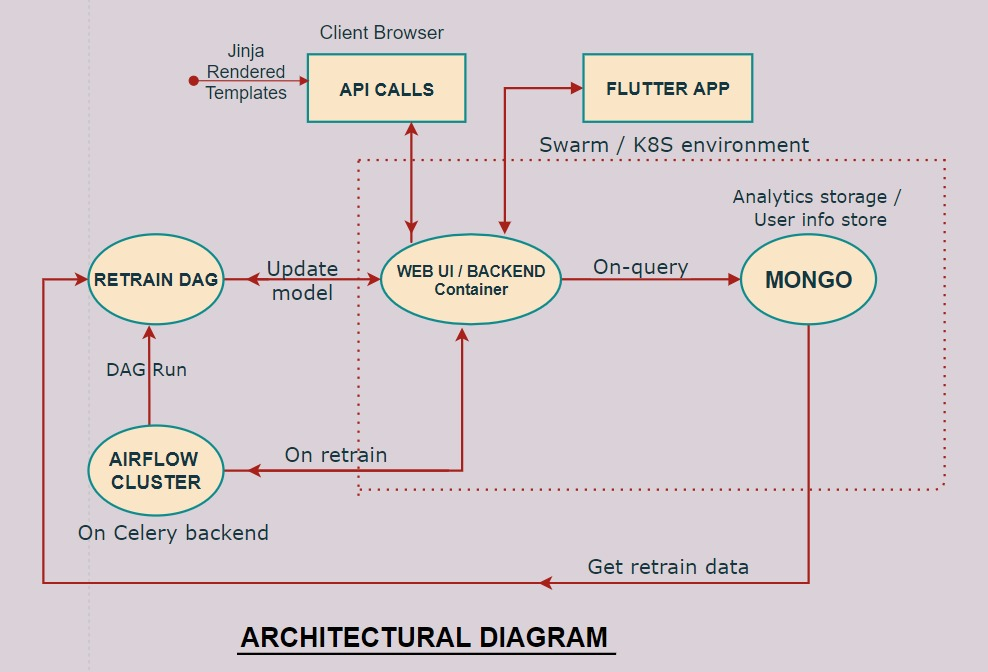
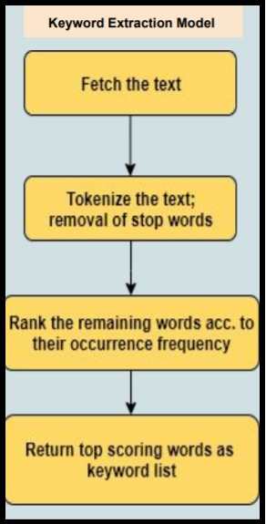
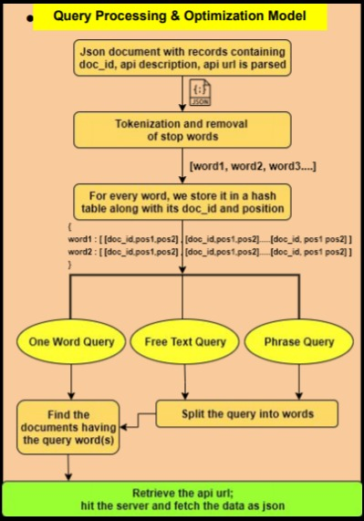
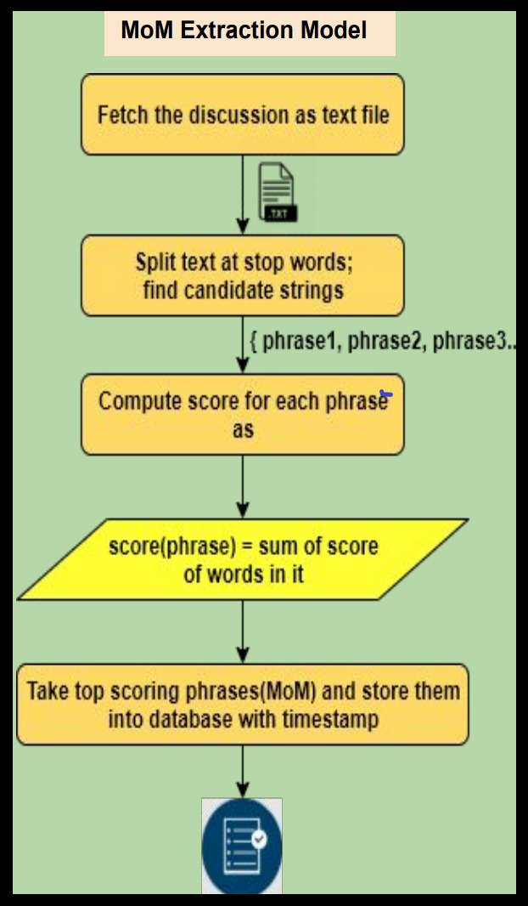
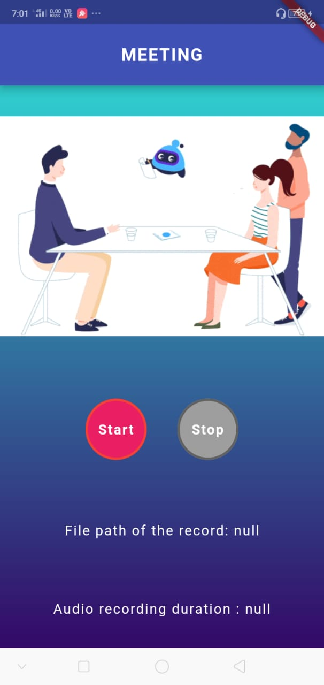
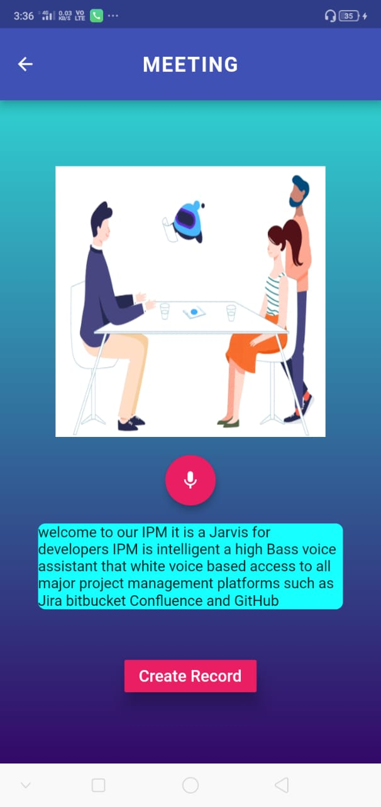
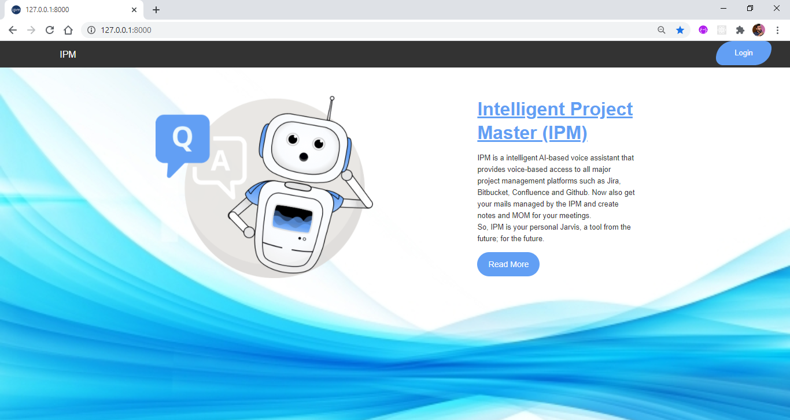

# Welcome to Intelligent Product Master - IPM! 

## About the project

> **Jarvis (software robot assistant) for corporations**

**Description:** ***Background:*** Today organizations have multiple tools and systems to help assist them in their day to day software development activities. There is need of a system which can connect to applications, mine & analyze data and provide results to stakeholders whenever they need it. Problem Statement: For example, questions to
assist development activities could be: What is the status of the release of Project X that was due this Friday? Why was Feature Y not fulfilled in the last release for Project X? How many test cases failed in the last release of Project X? Send me an email with the last release notes for Project X How to install Project X? How was Feature Z implemented? (Note: the robot would need to connect to all the applications, and dig out all the relevant information (description of features and linked commits / comments /guides) related the Feature Z Help me solve the class not found exception against “ClassName” (Note: this would mean running a query on stack overflow) Create an AI/ML based application to be hosted within a corporate/organization intranet with complete access to corporate/organization resources of JIRA, Confluence, Bitbucket and Stack Overflow. The primary responsibility of this software robot (Intelligent Product Master - IPM) is to learn-mine-analyze-serve information about a product to optimize development and support processes in a product team. IPM’s input interfaces would be a mic and email to receive input from users. IPM’s output interfaces would be speaker and email to revert to users. Following are the two main use cases (but not limited to) 1. Anyone can ask/look up for any information to IPM. It responds with accurate answer by voice-to-text-conversion/email. Mining existing data (could use APIs of the information hosting applications). Co-relating multiple information, analyzes and respond text-to-voice/email. 2. Take the Speaker in a meeting (example: scrum ceremonies/meetings). It records the meeting MOM in detail in its own data-reservoir (database). The scrum master can also instruct IPM to do multiple activity during the meeting. Say: Create a jira task, pull out the last updated jira task. Send me the last email from XYZ to me etc. To implement this, you can use a computer/speak/mail server and client, Voice-text-voice converter, text to jira / confluence / bitbucket / Stack Overflow APIs, AI to Analyze data to get accurate information, ML to learn when taken in a meeting. The key challenges in the problem would be to architect an information store that is optimally designed to answer queries, and accurately answer questions posed to it. For voice to text, and text to voice, you may use standard (free) libraries/services available in the market.

## Features

> - Modular Object Oriented Designing approach that makes any part easily replacable
>- No Security Vulnerabilities
>- All license handled
>- Modular Object Oriented Designing approach that makes any part easily replacable
>- No Security Vulnerabilities
>- All license handled
> ###  Github
> - Voice based commands to find details of various repositories of the user .
>- User can find commits, pull requests as well as issues of any repository.   
>###  Jira
>- Issues can be created, updated or deleted through voice commands.
>- Attachment actions like creating attachment as a comment or adding them. 
>###  Confluence
>- Voice based creation of pages.
>- Organises your attachment in folders.
>- Easily checks if a task is complete, assigned or due
>###  Bitbucket
>This module intelligently answers user's query, regarding any repository on BitBucket.
Main query include-
>- Manage repositories like granting permission to an specific user or group,getting branching model,etc
>- Manage projects like creating a project, fetching project summary.
>###  Minutes OF Meetings
>This module intelligently creates MOM during the scrum ceremony for the future reference 
## Architectural diagram

## Workflow

| Query Processing  | Keyword Extraction | MoM Extraction |
| ------------- | ------------- | ------------- |
|    |   |   |

## Screenshots
- Flutter MoM 
     
   
- Main Screen 

## Resources
- https://github.com/PyGithub/PyGithub
- https://github.com/usablica/intro.js/
- https://github.com/dongjun-Lee/text-summarization-tensorflow
- https://airflow.apache.org/
- [https://github.com/apache/airflow](https://github.com/apache/airflow)
- https://github.com/flutter/flutter
- https://pub.dev/

## License
[MIT License](https://github.com/sandeepinigithub/IPM/blob/master/LICENSE) 

> Contributors :
> - [Tarun Agarwal](https://github.com/TechTarun)
> - [Sandeep Kumar Shukla](https://github.com/sandeepinigithub)
> - [Sumrah Fatima](https://github.com/sumrah)
> - [Kritika Gupta](https://github.com/kritikagupta0007)
> - [Kumar Satyarth](https://github.com/ksatyarth2)
> - [Hari Om kushwaha](https://github.com/hariomkushwaha)

## Future Scope
>- Designing of flutter application that enhances experiences of web application

## Installation
### Steps are-
>- Note : While setting project don't forget to add your personal token (of github etc) and credential .
#### 1- Clone the repository
#### 2- Create a new virtual environment
#### 3- Now install the requirements.txt file
#### 4- Now run the server as python manage.py runserver
